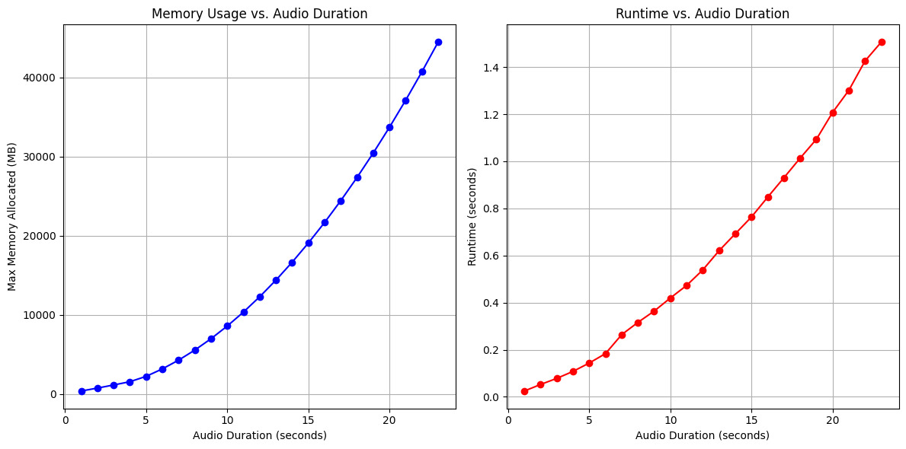

# MPSENet

Python package of [MP-SENet](https://github.com/yxlu-0102/MP-SENet) from [Explicit Estimation of Magnitude and Phase Spectra in Parallel for High-Quality Speech Enhancement](https://arxiv.org/abs/2308.08926).

> This package is inference only. To train the model, please refer to the original repository.

## Installation

```bash
pip install MPSENet
```

## Usage

```python
import sys
import librosa
import soundfile as sf
from MPSENet import MPSENet

model = sys.argv[1]
filepath = sys.argv[2]
device = sys.argv[3] if len(sys.argv) > 3 else "cpu"

model = MPSENet.from_pretrained(model).to(device)
print(f"{model=}")

x, sr = librosa.load(filepath, sr=model.sampling_rate)
print(f"{x.shape=}, {sr=}")

y, sr, notation = model(x)
print(f"{y.shape=}, {sr=}, {notation=}")

sf.write("output.wav", y, sr)
```

> The best checkpoints trained by the original author are uploaded to Hugging Face's model hub: [g_best_dns](https://huggingface.co/JacobLinCool/MP-SENet-DNS) and [g_best_vb](https://huggingface.co/JacobLinCool/MP-SENet-VB)

## Memory Usage and Speed

By default, the model will chunk the input audio into 2-second segments and process them one by one. This is to prevent memory overflow and allow the model to run on almost any machine out of the box.

If you have enough memory, you can set `segment_size` to a larger value (e.g., 160,000 for 10 seconds), which may help to generate better results in some cases.



| Segment Length (sec) | Max Memory (MB) | Runtime (sec) |
| -------------------- | --------------- | ------------- |
| 1                    | 388.38          | 0.0248        |
| 2                    | 759.41          | 0.0526        |
| 3                    | 1151.13         | 0.0784        |
| 4                    | 1563.53         | 0.1082        |
| 5                    | 2239.46         | 0.1436        |
| 6                    | 3180.23         | 0.1836        |
| 7                    | 4286.47         | 0.2641        |
| 8                    | 5558.20         | 0.3161        |
| 9                    | 6995.40         | 0.3640        |
| 10                   | 8598.08         | 0.4197        |
| 11                   | 10366.24        | 0.4729        |
| 12                   | 12299.87        | 0.5390        |
| 13                   | 14398.99        | 0.6204        |
| 14                   | 16663.58        | 0.6922        |
| 15                   | 19093.66        | 0.7638        |
| 16                   | 21689.21        | 0.8480        |
| 17                   | 24450.23        | 0.9302        |
| 18                   | 27376.74        | 1.0135        |
| 19                   | 30468.73        | 1.0935        |
| 20                   | 33726.19        | 1.2075        |
| 21                   | 37149.13        | 1.3012        |
| 22                   | 40737.56        | 1.4260        |
| 23                   | 44491.46        | 1.5061        |
| 24                   | OOM             | OOM           |

> Tested on A40 GPU with 48G VRAM. See [scripts/benchmark.py](scripts/benchmark.py) for more details.
